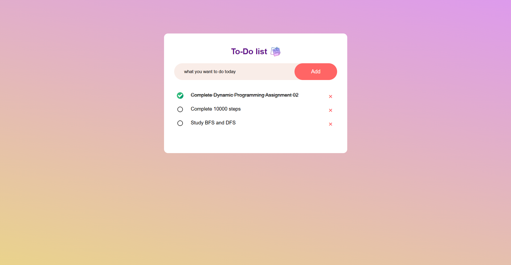

# To-Do- List 

A simple and user-friendly To-Do List web app built with HTML, CSS, and JavaScript. It allows users to add, complete, and delete tasks for better daily organization. Tasks are saved locally, so they remain intact even after the page is reloaded.

## 📸 Screenshot

## ✨ Features

- ✅ Add new tasks
- 🗑️ Delete tasks
- ✔️ Mark tasks as complete
- 💾 Tasks persist after page reload (localStorage)

## 💻 Technologies Used

- HTML
- CSS
- JavaScript

## 📂 How to Use

1. Clone or download the repository
2. Open the `index.html` file in your browser
3. Start adding your tasks!

## Author

Made with 💖 by Ananya Gujral
